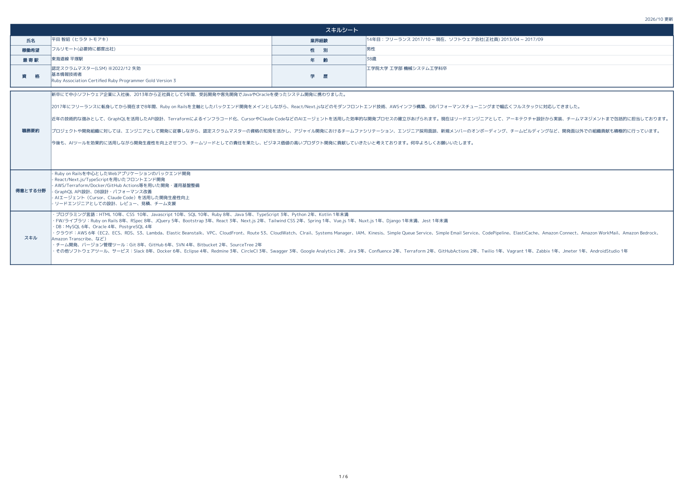

# スキルシート管理ガイド

Markdownで経歴を更新し、同じ内容を指定のExcel書式へ出力する。提出時は`excel/skill-sheet.xlsx`を使用する。

## ファイルの役割

| ファイル | 役割 | 更新方法 |
| --- | --- | --- |
| `README.md` | プロフィール、職務要約、スキル、案件一覧の正本 | 直接編集する |
| `project/main-job/*.md` | 本業案件の詳細の正本 | READMEの要約・期間・リンクと整合させる |
| `project/side-job/*.md` | 副業案件の詳細の正本 | READMEの要約・期間・リンクと整合させる |
| `excel/templates/スキルシート_当てはめ済み_202605_最寄駅修正.xlsx` | 指定された原本。2026年5月時点の経歴を含む書式見本 | 元ファイルをバイト単位で保持する |
| `excel/skill-sheet.xlsx` | READMEから生成した提出用Excel | スクリプトで再生成する |
| `scripts/export_skill_sheet.py` | Markdownの読み取りとExcel生成 | 項目や出力方法を変更するときに更新する |

原本の経歴・プロフィールは過去の内容であり、最新経歴の正本ではない。原本を提出用に使わず、生成Excelと区別する。保管した原本のSHA-256は以下のとおり。

```text
bc10cb1906270e4c16cd6f15cf55b494036993b61e7d0772ef5389e68f7812db
```

生成Excelは`スキルシート（エンジニア）`の1シート構成で、原本のセル結合、罫線、プロフィール配置を活用し、読みやすさに応じて列幅を調整する。READMEのプロフィール、職務要約、スキル、案件一覧を転記し、本業・副業を区別する。案件数はREADMEに従い、固定しない。

`project/`の詳細本文はExcelに追加せず、READMEに記載した案件のリンクを残す。原本の`言語ゲンゴ`などの見出しは生成時に正規化し、長文の折り返し、行高、印刷設定を読みやすく調整する。補助シートは追加しない。

Excel上部の左側は「氏名」「稼働希望」「最寄駅」の順に表示する。READMEでは`氏名`と`フリガナ`を別項目で管理し、Excelの氏名欄には`氏名（フリガナ）`と全角括弧でまとめて転記する。稼働希望は専用の行へ転記し、最寄駅欄には駅情報だけを表示する。

Excelの「得意とする分野」にはREADMEの`【得意分野】`だけを表示する。プロフィール項目のエリア・稼働時期・所属はこの欄に追記しない。

READMEの`【スキル経験】`にある`キャリア`は、「業界経験」の年数横へ`14年目：フリーランス …、ソフトウェア会社(正社員) …`のように全角コロンで区切って表示する。「スキル」欄には重複して表示しない。

担当工程は幅を広げた8列に横書きの見出しで表示する。担当した工程は大きな黒丸と薄い背景色で示し、入力規則・プルダウンは生成時にすべて除去する。セルを選択してもプルダウンの矢印が黒丸に重ならない。

見出し・背景・罫線は、全体を担当工程と同じ濃い青`17365D`と薄い青`E9F1F8`で統一する。原本の書式は変更せず、生成時に配色を適用する。

プロフィール欄の配色例（1ページ目）：



担当工程の表示例（先頭2案件の抜粋）：


## セットアップと生成

Python 3.11以上を使用する。`openpyxl`のバージョンは`requirements.txt`で固定する。

リポジトリのルートで実行する。

```bash
python3 -m venv .venv
source .venv/bin/activate
python -m pip install -r requirements.txt
python scripts/export_skill_sheet.py
```

既定の出力先は`excel/skill-sheet.xlsx`。別の場所に出力する場合は`--output`で指定する。

```bash
python scripts/export_skill_sheet.py --output /tmp/skill-sheet.xlsx
```

## 通常の更新手順

1. `README.md`の該当箇所を編集し、先頭の更新年月を現在の年月にする。
2. 案件詳細にも変更がある場合は対応する`project/`のファイルを更新し、READMEの要約と矛盾しないことを確認する。
3. `python scripts/export_skill_sheet.py`でExcelを再生成する。
4. 同期チェックとテストを実行する。
5. Excelを開いて内容と表示を確認し、Markdownと生成Excelを同じPRに含める。

```bash
python scripts/export_skill_sheet.py --check
python -m unittest discover -s tests -v
```

同期チェックで差分が出た場合は、正本と生成処理を確認して再生成し、チェックをやり直す。提出前にはプロフィール、案件の区分・件数・期間、リンク、工程欄、長文の見切れや印刷時の読みやすさを確認する。

### 項目・案件を追加する

- 既存のプロフィール項目やスキル区分、案件内の項目は、READMEの表・箇条書きの記法に合わせる。
- 新しい種類の項目を追加した場合は、生成Excelに反映されることを確認する。対応していなければ生成処理と必要な検証も更新する。
- 案件は本業・副業の該当区分に新しい順で追加する。進行中は`【現案件】`に記載し、副業の場合は案件タイトルの末尾に`＜副業＞`（`<副業>`も可）を付ける。
- 過去案件の詳細ファイルは、該当する`project/main-job/`または`project/side-job/`へ`YYYYMM-YYYYMM.md`の形式で追加し、READMEからリンクする。
- Excelの案件枠だけを追加せず、READMEへの追加後に再生成する。

### 担当工程の黒丸を更新する

READMEの各案件に`担当工程`を記載し、作業内容を説明する`工程/作業`と分けて管理する。黒丸の対象は次の8項目から列挙する。

`要件定義、基本設計、詳細設計、実装、単体テスト、結合テスト、総合テスト、保守運用`

実装と単体テストだけを表示する場合の例：

```markdown
  - 工程/作業：機能開発、リファクタリング、コードレビュー
  - 担当工程：実装、単体テスト
```

- `担当工程`がある場合は、この列挙だけを黒丸に反映する。作業説明に他の工程名があっても追加しない。
- 8項目の名称をそのまま使用する。「設計」など一覧にない名称や誤字がある場合は生成エラーになる。
- `担当工程：`を空欄で記載した場合は、8列すべてを空欄にする。
- `担当工程`の項目がない既存案件だけ、`工程/作業`に明記された工程名から従来どおり判定する。一般的な「設計」を基本設計・詳細設計へ広げるなどの推測は行わない。
- 本人の確認など根拠に基づいて更新し、対応する案件詳細にも担当工程を記載して整合させる。Excelを再生成し、対象案件の8列を確認する。

### 期間を変更する・案件を終了する

- 期間を修正する場合は、READMEの開始・終了年月、月数表記、詳細ファイルの本文とファイル名、リンクをまとめて確認する。
- 本業案件が終了したら、`【現案件】`から`【過去案件: フルタイム案件】`へ移す。副業案件が終了したら、`【過去案件: 副業案件】`へ移す。
- 終了年月を確定し、`project/main-job/YYYYMM-YYYYMM.md`または`project/side-job/YYYYMM-YYYYMM.md`を作成・更新してREADMEにリンクする。
- 期間や区分の変更後はExcelを再生成し、出力が一致することを確認する。

## 情報と書式の扱い

- 数値、経験年数、人数、成果、担当工程は、README・案件詳細や本人の確認など根拠のある情報を記載する。原本の古い値や推測で埋めない。
- 担当工程の空欄は「未記載」。未経験を意味するものではなく、原本のチェックもそのまま流用しない。
- Excelだけの手修正は再生成で上書きされる。残したい内容は先に正本へ反映し、書式変更は生成処理へ反映する。
- 原本の差し替えや再デザインが明示的に求められた場合は、実物を開いて確認してから対応する。原本を参照できない場合、推測した別のテンプレートへ置き換えない。
